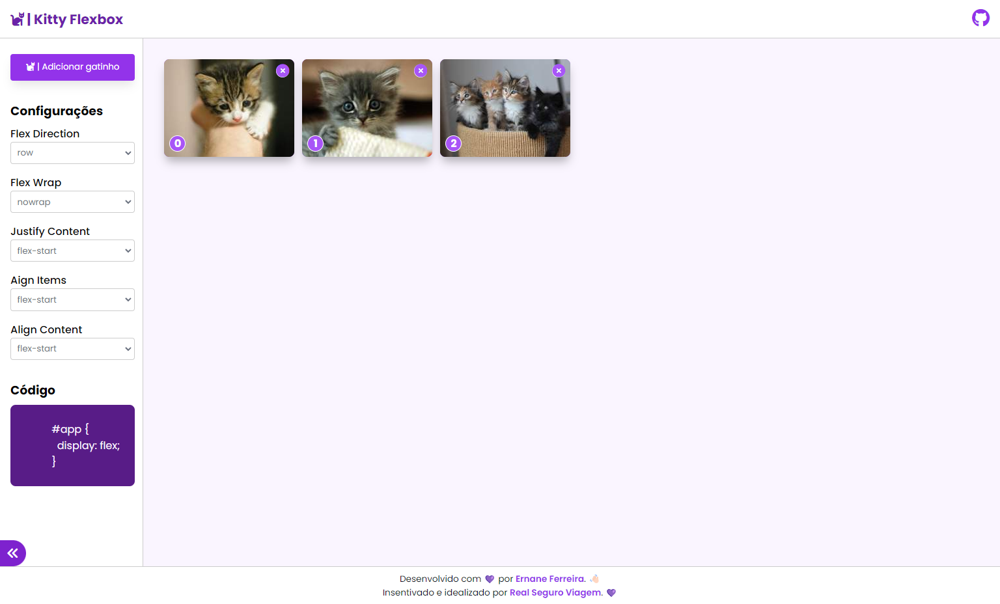

<h1 align="center">
  🐈 Kitty Flexbox 🐈
</h1>

 

  

  

## 🚀 Tecnologias

Esta aplicação foi desenvolvida com as seguintes tecnologias:

- HTML
- CSS
- Javascript

## 💻 Projeto

Aplicação para testar e demonstrar a usabilidade de propriedades css referentes ao flex layouts. O intuito é conseguir manipular a DOM de forma que, em tempo de execução, o layout se altere de acordo com as opções escolhidas pelo usuário.

## 💻 Acesse
<a target="_blank" rel="noopener" href="https://ernanej.github.io/kitty-flexbox/">Clique aqui</a> para acessar a aplicação.

---

  Desenvolvido com ❤ por <a target="_blank" rel="noopener" href="https://www.ernane.dev/">Ernane Ferreira</a>. 👋🏻  Incentivado e idealizado por <a target="_blank" rel="noopener" href="https://www.seguroviagem.srv.br/">Real Seguro Viagem</a>. 💜

